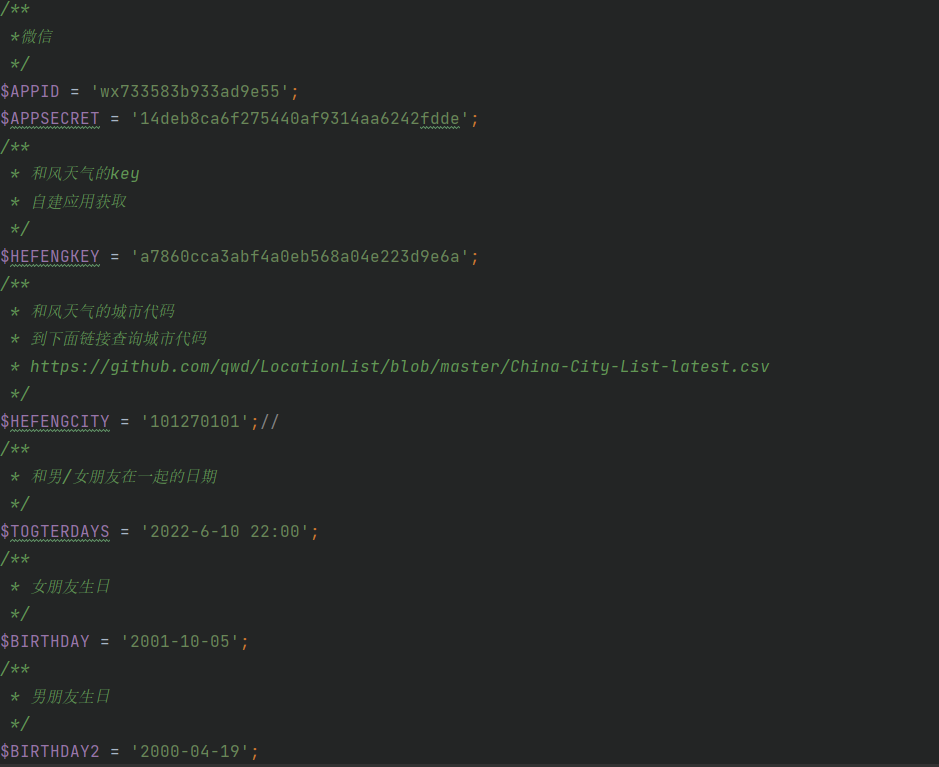

# 微信模板消息

发送你的模板消息给你的男/女朋友，嘿嘿~

### 步骤

1、注册微信公众号平台。

- [微信公众号平台]([https://mp.weixin.qq.com/debug/cgi-bin/sandboxinfo?action=showinfo&t=sandbox/index])
- 获取appID appsecret（等下会使用）

2、注册和风天气并申请为个人开发者

- [和风天气](https://console.qweather.com/#/apps)
- 创建应用 并获取到KEY（等下会使用）
- 

3、准备好本地PHP运行环境（可以使用phpstudy xampp等，只要能运行就行）或线上PHP运行环境

- 将Duck.php wechat.php 放到环境里
- 更改wechat.php 里下图信息
- 

### 自动发送

1. 可以使用bt的计划任务添加定时访问url 或 定时shell 脚本定时发送

   EG:

   也可以使用linux下的crontab


### 注意

1. 默认给所有关注了测试号的人发送模板消息
2. 默认给模板列表 序号1的模板发送消息 无需自行添加模板ID

### 效果


### 模板代码

```
时间:{{date.DATA}}
位置:{{city.DATA}}
天气:{{weather.DATA}}
气温:{{temp.DATA}}
湿度:{{humidity.DATA}}
穿衣指数:{{indices.DATA}}
我们已经在一起{{togetherdays.DATA}}了
距离扁嘴伦生日还有{{birthday.DATA}}天
距离大公鸡生日还有{{birthday2.DATA}}天
{{qinghua.DATA}}
```

复制到

