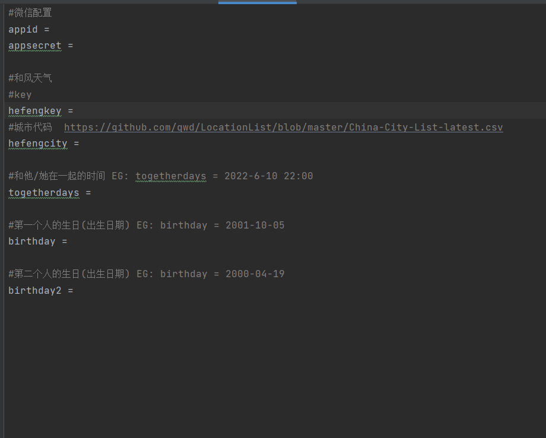
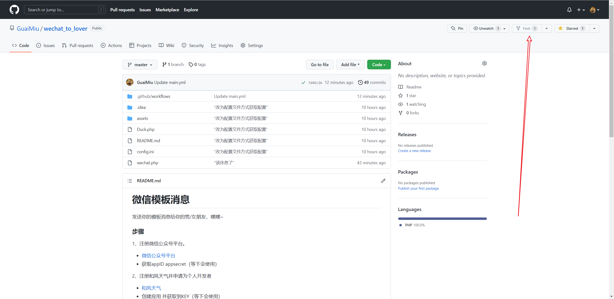
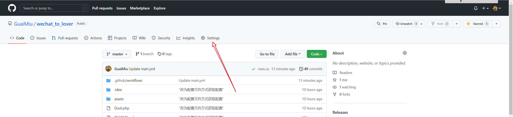
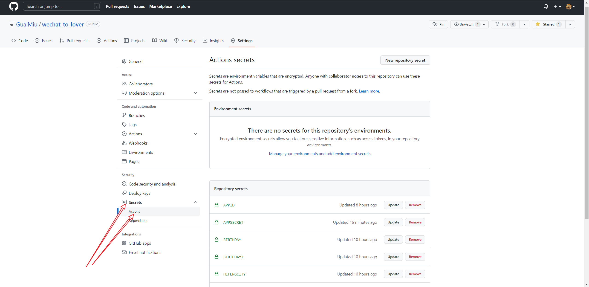
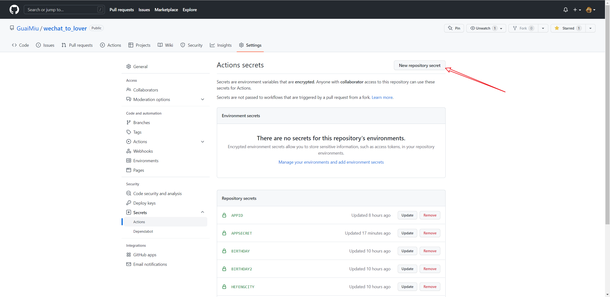
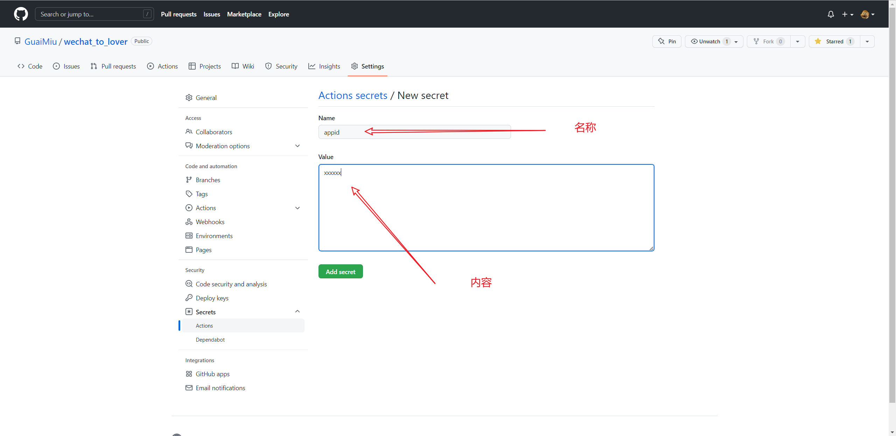
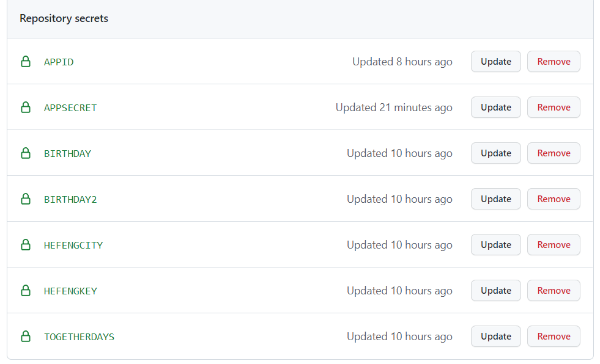
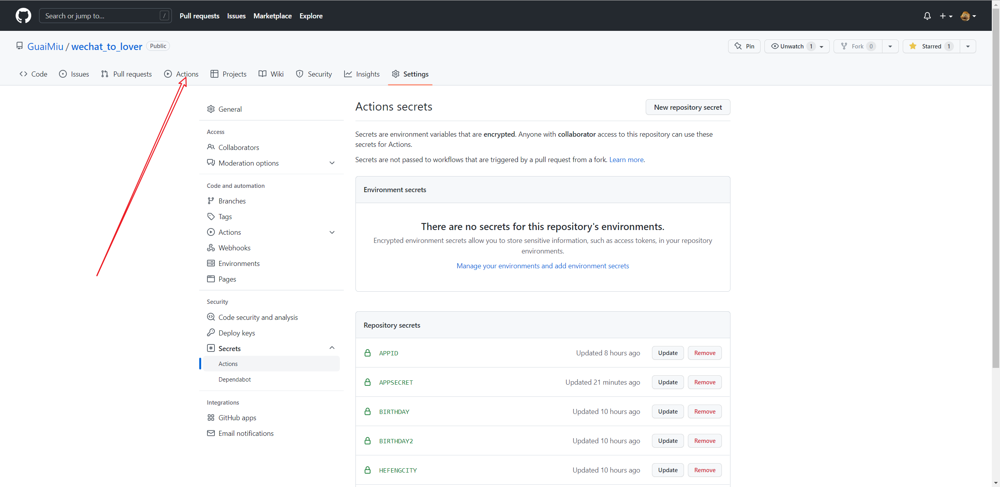
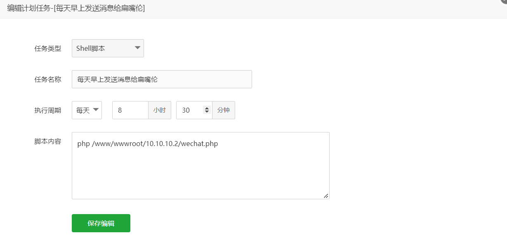
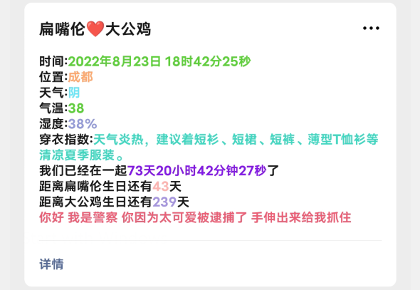

# 微信模板消息

发送你的模板消息给你的男/女朋友，嘿嘿~

### 步骤

1、注册微信公众号平台。

- [微信公众号平台](https://mp.weixin.qq.com/debug/cgi-bin/sandboxinfo?action=showinfo&t=sandbox/index)
- 获取appID appsecret（等下会使用）

2、注册和风天气并申请为个人开发者

- [和风天气](https://console.qweather.com/#/apps)
- 创建应用 并获取到KEY（等下会使用）
- 

3、准备好本地PHP运行环境（可以使用phpstudy xampp等，只要能运行就行）或线上PHP运行环境

- 将Duck.php wechat.php config.ini放到环境里
- 更改config.ini里下图信息
- 

### 自动发送

#### 免费定时发送 天气信息给女朋友（Gihub Action）

1. 注册Github

2. fork 本库 [[wechat_to_lover]](https://github.com/GuaiMiu/wechat_to_lover)

3. 点击Settings

4. 点击Secrets =>Actions

5. 点击

6. 新建配置项

7. 依次添加一下信息

   ```
   #微信配置
   appid 
   appsecret 
   
   #和风天气
   #key
   
   hefengkey 
   #可以填中文的 省 市 区县
   hefengcity 
   
   #和他/她在一起的时间 EG: togetherdays = 2022-6-10 22:00
   togetherdays 
   
   #第一个人的生日(出生日期) EG: birthday = 2001-10-05
   birthday 
   
   #第二个人的生日(出生日期) EG: birthday = 2000-04-19
   birthday2 
   ```

8. 添加后能看到自己所添加的配置项

9. 然后点击 注:第一次会提示什么（忘了），反正同意就行

10. 点击CI 点击RUN就能运行测试了


##### 自建或购买服务器

1. 可以使用bt的计划任务添加定时访问url 或 定时shell 脚本定时发送 也可以使用linux下的crontab

EG:


### 注意

1. 默认给所有关注了测试号的人发送模板消息
2. 默认给模板列表 序号1的模板发送消息 无需自行添加模板ID

### 效果



### 模板代码

```
时间:{{date.DATA}}
位置:{{city.DATA}}
天气:{{weather.DATA}}
气温:{{temp.DATA}}
湿度:{{humidity.DATA}}
穿衣指数:{{indices.DATA}}
现有确诊:{{currentConfirm.DATA}}
新增确诊:{{lastLocalSureNew.DATA}}
新增无症状:{{lastIncrHideNew.DATA}}
我们已经在一起{{togetherdays.DATA}}了
距离扁嘴伦生日还有{{birthday.DATA}}天
距离大公鸡生日还有{{birthday2.DATA}}天
{{qinghua.DATA}}
```

复制到

